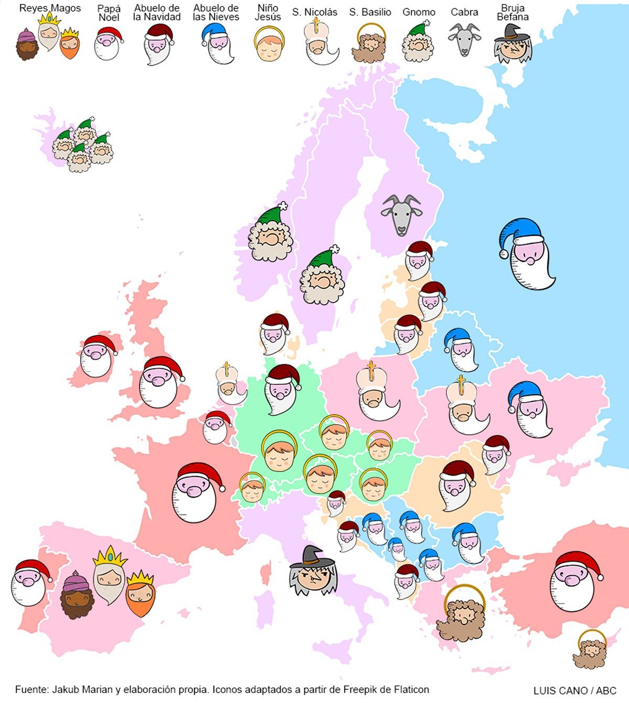

Hoxe atopábame polas redes con unha imaxe que xa ten uns anos. Un mapa de Europa que indica quen é responsable de traer agasallos nestas datas de Nadal segundo a tradición ou cultura de cada lugar.

<small>[Imaxe orixinal do artigo do 2019 do ABC](https://www.abc.es/sociedad/abci-quien-trae-regalos-navidades-cada-pais-europa-201901040249_noticia.html#vtm_modulosEngag=lomas:autor:noticia:4)</small>

Pareceume bonito ver esta mestura de tradicións e diversidade cultural que temos en Europa e púxenme a indagar un pouco en cada un dos protagonistas de cada país. O resultado é unha amalgama de ritos pagáns, figuras cristianas e readaptacións modernas.

## Reis Magos
Baseada no relato bíblico do Evanxeo de Mateo parece que chegou a nós con moita máis nitidez ou concrección da que tiñan nun inicio. No Evanxeo non especifica **nin cantos eran nin os seus nomes**, de feito, **nin sequera que fosen reis**. Fálanos vagamente de uns magos que viñan de oriente, referíndose a palabra *mago* a algo distinto á maxia que coñecemos hoxe en día, mais ben a algo como unha casta de **astrónomos** ou sabios das estrelas.

Sí se fala dos tres agasallos: ouro, incenso e mirra. De ahí acabouse deducindo o de que fosen tres magos. Ao redor do século VI aparecen por primera vez os nomes de Melchor, Gaspar e Baltasar. Iconograficamente representan as 3 edades do home e, máis recentemente, dende o século XV, comézase a facer referencia ás tres partes do mundo coñecido: Europa, Asia e África.

Chegan en camelos dende Oriente a España e a parte de Portugal o 6 de xaneiro. Tamén ten moita tradición en Latinoamérica froito da herencia Española.

## _Sinterklaas_ / San Nicolás
É a figura que serviu de inspiración para o moderno Papá Noel pero con unha tradición real, moi antiga e profunda en Europa.

Está inspirado en San Nicolás de Bari (S. IV) bispo de Mira (Turquía). É o patrón dos mariñeiros.

Chega a Países Baixos, Flandes (Bélxica) e partes de Alemaña, pero atención á loxística que foi do que máis me sorprendeu: tradicionalmente neses lugares dise que chega en barco **dende España**.

Monta un cabalo branco chamado *Amerigo* e leva de compañeiro a *Pedro el Negro*.

##  Santa Claus / Papá Noel
É a versión máis estandarizada a nivel global, pero non é máis que unha **mestura recente** do folclore tradicional europeo con márketing americano. É a copia de *Shein* de San Nicolás.

Os inmigrantes holandeses levaron a tradición do _[Sinterklaas](#sinterklaas--san-nicolás)_ a *Nova Ámsterdan* (posteriormente renomeada como *Nova York*), e _Sinterklaas_ derivou fonéticamente en _Santa Claus_. Fin da tradición.

No séculos XIX xa estaba estandarizada a súa imaxe tal e como é, e nos anos 30 globalizouse a todo o mundo da man de Coca-Cola.

Se non hai moito que falar do propio Papá Noel, sí de algún mito recente como o de que orixinalmente vestíase de cor verde e foi Coca-Cola quen o vestiu do vermello actual. Esto é falso, ou cando menos é unha verdade a medias. Xa no século XIX se vestía de vermello, e ten sentido xa que o vermello adoitaba ser a cor das vestiduras dos bispos e lembremos que o primixénio San Nicolás era bispo.

Pero como en moitos mitos, algo de certo hai no fondo, e é que antigamente no folclore inglés existía un personaxe chamado _**Father Christmas**_ (Pai Nadal ou Avó do Nadal) que non repartía agasallos pero representaba o espíritu do Nadal. **Vestía de verde** con unha coroa de follas de hedra ou acivro. Co tempo acabouse fusionando co *San Nicolás* e quedouse coas vestimentas vermellas. Esta especie de ramificación europea da evolución de San Nicolás aínda **é o encargado dos agasallos nalgúns países do norte de Europa**.

O que sí fixo a campaña de globalización de Coca-Cola foi estandarizar a imaxe de ese avó risueño e un pouco gordo.

Chega nun trineo voador tirado por renos (Rudolph y compañía) a parte de Europa occidental, a norteamérica e a gran parte do mundo por influencia e márketing o 25 de decembro.

## A Bruxa Befana
Ten a imaxe icónica que coñecemos de unha bruxa, pero é unha figura afable e entrañable do Nadal italiano. ¿Pero de onde sae unha bruxa *random* levando agasallos por Italia?

Pois ten que ver cos nosos [Reis Magos](#reis-magos). Cando ían camiño a Belén parece ser que se perderon e pararon xunto a Befana a perdille orientación. Ela díxolle por onde tiñan que ir, pero a pesar de que eles lle pediron que os acompañase, ela negouse porque tiña tarefas domésticas que facer. Barrer, concretamente, Coa vasoira que a acompaña.

Arrepentida, un pouco máis tarde saíu na busca dos Reis Magos para axudalos, con doces, pero nunca máis os atopou. Dende aquela anda por todas as casas levando agasallos e doces esperando atopar nunha de elas ao neno Xesús.

Viaxa voando por Italia na sua escoba e entra polas chemineas o 6 de xaneiro. Tamén **barre a casa** para barrer así os problemas do ano anterior no traspaso ao ano novo.

## *Christkind* / O Neno Xesús
Este posiblemente sexa o segundo invento marketiniano máis cutre desta listaxe despois de Papá Noel, bastante recente e con intencións puramente teolóxicas.

Durante a **reforma protestante** (S. XV - XVI) Martín Lutero quería acabar con todo tipo de veneración a santos (Como o propio San Nicolás) e redirixir a atención únicamente a Cristo, así que creou esta figura a medida que sería a encargada de repartir os agasallos do Nadal.

É un neno con cabelo dourado e aspecto anxelical que deixa os agasallos o 24 de decembro sin que nadie o vexa en Austria, Suiza, República Checa, Hungría e Alemaña. Nesta última, curiosamente con máis arraigo hoxe en día na zona sur, católica, que na Alemaña do norte, un pouco máis protestante.

## *Ded Moroz* / O avó do frío ou das neves
É un mago invernal que viste una abrigo azul longo ata os pés. Vai sempre acompañado da súa neta _Snegúrochka_. Orixinalmente era unha **deidade eslava** que personificaba a **forza da natureza** e que viaxaba por bosques e campos provocando xeadas co seu bastón.

Tras a Revolución Rusa de 1917 o Nadal foi prohibido. En 1935, Stalin rehabilitou a *Ded Moroz* como figura secular para celebrar el Ano Novo desvinculándoo da relixión.

Viaxa nunha *troika* (un trineo tirado por tres cabalos) co seu bastón máxico e o 31 de decembro leva agasallos por Rusia, Ucrania, Bielorrusia e outros países ex-soviéticos.

## *Joulupukki* / A cabra do Nadal
Ten unha forte orixe pagana e ancestral. Provén dos _Nuuttipukki_, homes que se vestían con peles e cornos de cabra para pedir sobras e asustar espíritus.

Hoxe en día deturpouse e represéntase co mesmo aspecto que o [Papá Noel](#santa-claus--papá-noel) e vive en *Rovaniemi*, onde por un asequible voo de Ryanair podes ir a vivir *el espíritu de la navidad*, case ao nivel das Luces de Vigo. Curiosamente hoxe en día parece que, polo menos en Europa, *Rovaniemi* vai sustituíndo o orixinario Polo Norte como residencia de Papá Noel, a pesar de que era algo localizado do *Joulupukki*. É moi peculiar como a cultura -e o marketing- van mesturando hábitos e tradicións facéndonos perder a veces as trazas orixinarias das mesmas.

Polo menos aínda se conserva o nome orixinal. 

O *Joulupukki* entra nas casas de Finlandia pola porta en lugar de polas chemineas.

## Tomte / Nisse / Gnomos ou duendes
Espíritus domésticos invisibles que coidan o gando e a granxa en xeral. Polo xeral son bos pero temperamentais, se non lle deixas un plato con gachas e manteiga en Noiteboa cabreanse e poden esconder cousas ou incluso matar algún animal doméstico, así que mellor non andarlle coas cosquillas.

Teñen o aspecto de gnomo ou duende que coñecemos actualmente, de baixa estatura barba longa e gorro vermello. Foi no século XIX cando a ilustración romántica os transformou es espíritus protectores e repartidores de agasallos con un rol parecido ao de San Nicolás

Reparten agasallos nos en países como Noruega, Suecia e Islandia.

## San Basilio
San Basilio o Grande foi un bispo do século IV coñecido pola súa extrema caridade e austeridade. O 1 de xaneiro reparte agasallos na Grecia ortodoxa e en Chipre.

