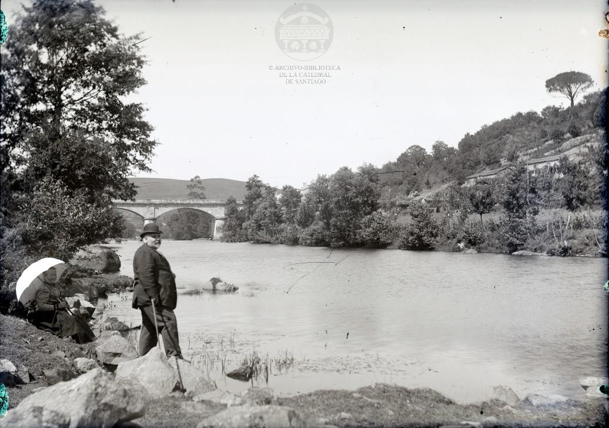
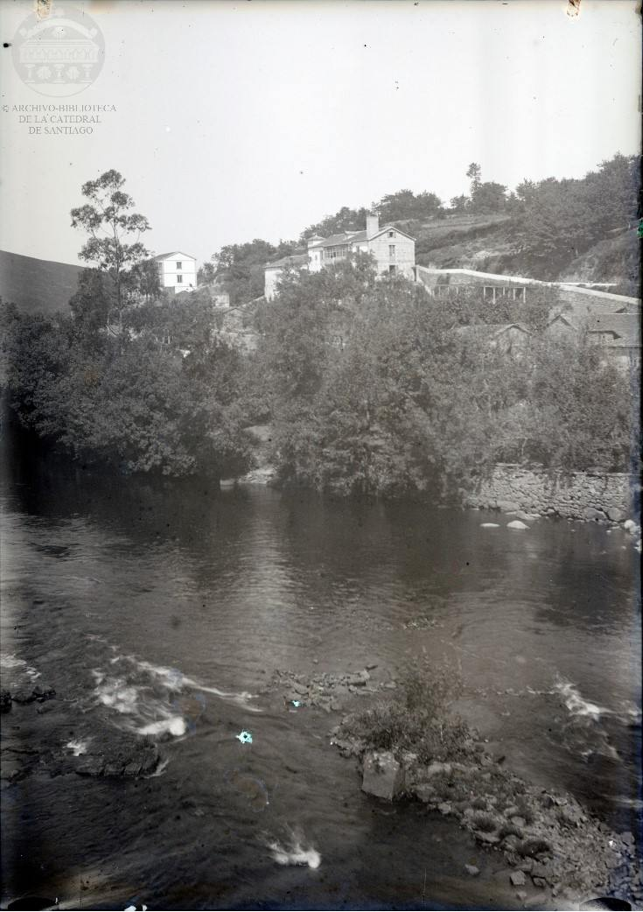
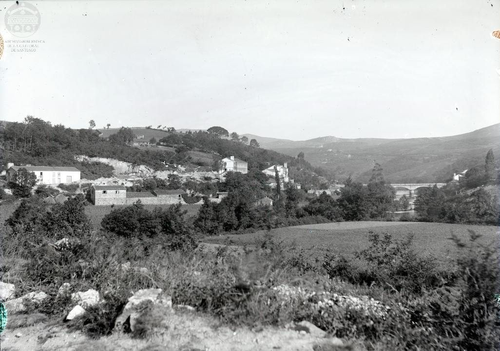

O pasado venres coñecíamos, a través do portal de [Cultura Galega](https://culturagalega.gal/noticia.php?id=37243), de que o [Arquivo Catedralicio](https://a3w-catedralsantiago.odilo.es/portalArchivo/consultas) de Santiago de Compostela viña de facer público o fondo fotográfico de José Limia Rodríguez, párroco e afeccionado á fotografía. 

Este fondo consta de 193 fotografías de entre 1894 e 1910 da contorna de Compostela. Tamén comentan que hai 61 negativos novos que están sendo catalogados e dixitalizados. A restauración, dixitalización e catalogación foron feitas polo fotohistoriador Carlos Castelao.

Na propia nova de Cultura Galega se amosa unha fotografía de Portomouro, pero ao tratarse de fotos da contorna de Compostela dispúxenme a indagar no fondo a ver qué podíamos atopar. Ata o momento atopei 3 fotografías de Portomouro que vos deixo a continuación. 

## Figura 1

C. 1891-1905. Esta posiblemenete sexa a máis vistosa das tres. Un home e unha muller atópanse ao lado do río Tambre, calculo que a uns 200 metros río arriba da ponte de Portomouro no lugar que a veces se coñece como *A Praia*. Podemos observar que a ponte debía estar coa súa remodelación recén rematada pois vese a pedra nova e limpa.

O señor ten un sombreiro de bombín, traxe e bastón. E a señora atópase sentada con un paraugas branco. Ao outro lado do río vemos varias edificacións no lugar que hoxe sería *O Rueiro*.

Parece evidente que esa zona estaba moi accesible para achegarse ao río, ao igual que pasa hoxe en día pola outra marxe. Tal vez se poida deducir de ahí a orixe de ese pequeno topónimo local de *A Praia*. 

## Figura 2

C. 1891-1905. Esta, pola altura, debe estar tomada dende o inicio da ponte, xunto o cruce que vai para Ames. Nela podemos ver o río Tambre con un muro de pedra na finca de en frente, e varias edificacións de pedra no *Camiño de Abaixo*. No alto vemos a *casa de Bruzos* pode que recén rematada, con unha gran cheminea e con outra edificación ao lado. E ao fondo vemos outra vivenda de varias plantas, que se non me engano é o edificio número 76 da rúa Entrepontes, onde se atopa hoxe o restaurante San Cristóbal e varias vivendas.

## Figura 3

C. 1891-1905. Esta fotografía debe estar tomada na *rúa Santa Comba*, a que sube hacia San Román. Nela podemos ver ao fondo a ponte sobre o Tambre e un pequeno anaco da *casa de Escravitude*. Nun primeiro plano tamén vemos o lugar onde hoxe se atopa hoxe o colexio de Portomouro, que era un campo de cultivo entre o río Dubra e o río Tambre.

No medio da fotografía, xunto a estrada, podemos ver á esquerda unha edificación que debe ser onde despois de situou o *Bar Camiño*. Xusto abaixo podemos ver unha alongada edificación de pedra que hoxe xa non existe. Se non me engano, un antigo almacén de sal.

Máis arriba, pola estrada, vemos unha pequena canteira no lugar que aínda se coñece hoxe co mesmo nome e xa máis adiante as mesmas dúas edificacións que víamos na figura 2.

Se nos fixamos no alto, chámame á atención unha pequena caseta que había alí arriba e sobretodo o alforamento granítico que sobresae. Non sei ben onde se localizaría exactamente ese afloramento, pero o certo é na zona de Barcelos podemos ver no nomenclátor que aparece alguna vez o nome de *A Leira das Pedras*. E uns metros ao sur, onde se atopa o pequeno petróglifo histórico, xusto abaixo do Castro, é unha zona na que tamén parece que houbese nalgún momento unha pequena actividade extractiva. Tal vez sexa por esa zona.

## *Outro*
Estas fotografías amósannos un pouco máis como era Portomouro e ponlle imaxe a algunhas cousas que xa só pertencían á memoria. 

A nivel xeral destacaría dúas cousas:
1. Absolutamente todo o monte que podemos ver ao lonxe estaba pelado conformando unha paisaxe moi distinta á que vemos hoxe en día. Para isto nin sequera fai falta ir tan atrás. Calquera dos nosos maiores nos confirman que así era aínda na súa xuventude.
2. O poder da memoria colectiva que nos permite perpetuar nomes e historias, por pequenos que sexan, moito máis alá do propio motivo. Lugares como *A Leira das Pedras*, *A Canteira*, ou *A Praia* posiblemente perdan a conexión co seu orixe co paso do tempo, pero seguirán dando nome a un lugar a traves de moitas xeracións.

